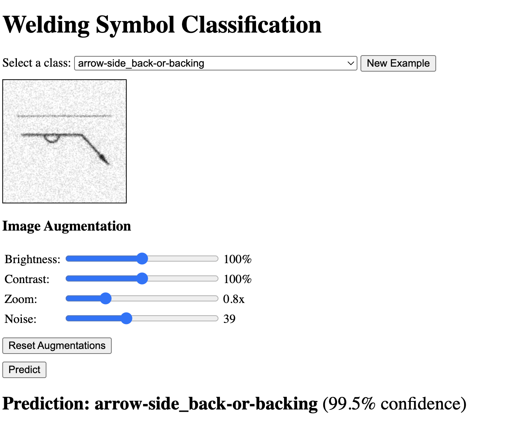

# Welding Symbol Classifier Project

This project provides a simple example of creating a welding symbol classifier. It includes data preparation, model training, and a web-based demo for interactive testing. The dataset is created from a single image consisting of basic welding symbols. These symbols are made in to a dataset by applying various data augmentations. The classifier is not aimed to predict welding symbols in real-world images, but rather to demonstrate the process of building a classifier, training it, and deploying it with a web interface.

## Demo UI - Screenshot



## Project Structure

```
.
├── app
│   ├── api/           # FastAPI backend serving the model
│   ├── ui/            # Web UI for demo and visualization
│   ├── nginx/         # Nginx config for serving the UI
│   ├── docker-compose.yml
│   ├── README.md
│   └── Screenshot_demo_ui.png
├── assets
│   ├── welding-dataset/                # Original welding symbol images
│   ├── welding-dataset_64x64_resized/  # Resized images for training
│   ├── models/                         # Trained model weights
│   └── ...                             # Other assets (sample images, etc.)
├── image_augmentation.py   # Script for augmenting images
├── resnet50_model.py       # Model definition and utilities
├── train.ipynb             # Jupyter notebook for training and evaluation
├── tools
│   ├── image_dataset_helper.py # Helper scripts for dataset management
│   ├── README.md
│   └── Screenshot_dataset_tool.png
└── .gitignore
```

### Explanation

- **app/**: Contains the web demo, including the FastAPI backend (`api/`), frontend UI (`ui/`), and Nginx config (`nginx/`). Use Docker Compose to run the demo locally.
- **assets/**: Datasets, trained models, and supporting images for training and testing.
- **image_augmentation.py**: Utilities for augmenting the dataset with transformations.
- **resnet50_model.py**: Defines the ResNet-50 model and related functions.
- **train.ipynb**: Notebook for preparing the dataset and training the model.
- **tools/**: Scripts and documentation for dataset management and preprocessing.

## How to Run the Demo

1. Install Docker and Docker Compose.
2. In the `app` directory, run:
   ```bash
   docker-compose up -d
   ```
3. Open [http://localhost:8080](http://localhost:8080) in your browser.