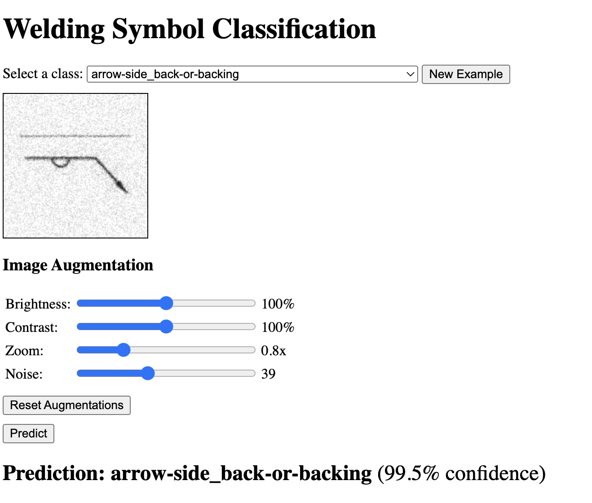

# Welding Symbol Classifier Demo

This app demonstrates an image classification model for welding symbols. The main goal is to showcase the model's capabilities through an interactive web UI.

The UI allows you to test the model with example images and provides simple image adjustment tools (brightness, contrast, zoom, noise) for experimentation before prediction.



## Services

- **api**: Python backend serving the image classification model (`api/`).
- **ui**: Web interface for testing and visualization, served by Nginx (`ui/`, config in `nginx/`).

## How to Run

1. Install Docker and Docker Compose.
2. In the `app` directory, run:

    ```bash
    docker-compose up -d
    ```

3. Open [http://localhost:8080](http://localhost:8080) in your browser.