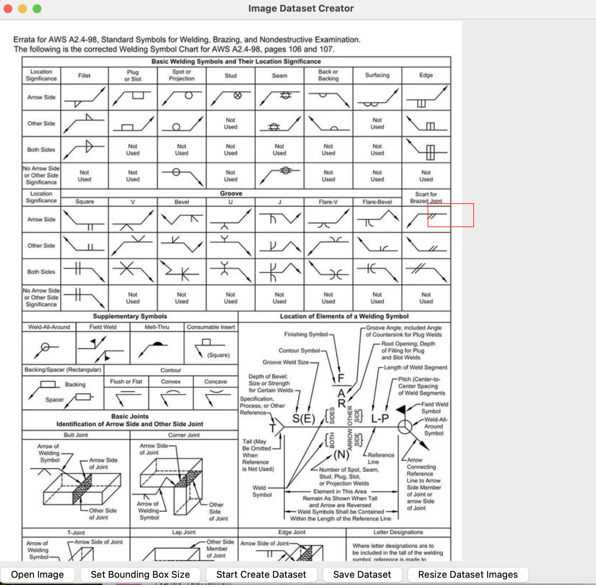

# Image Dataset Helper

This tool is a simple GUI application built with Python's `tkinter` library to help create a labeled image dataset from larger images. It is particularly useful for object detection or image classification tasks where you need to extract many small images (patches) of objects from a single source image and organize them into a classified dataset.



## Features

-   **Load Image**: Open and display common image formats (`.jpg`, `.png`).
-   **Custom Bounding Box**: Define a custom width and height for the patches to be extracted.
-   **Interactive Patch Extraction**: Click on the image to extract a patch of the defined size centered at the cursor position.
-   **Labeling**: Assign a class label to each extracted patch.
-   **Dataset Saving**: Save the collected patches into a structured directory format, where each class label corresponds to a sub-directory containing the respective images.
-   **Dataset Resizing**: Resize all images in an existing dataset folder to a new specified dimension, preserving the aspect ratio by padding.

## Requirements

-   Python 3
-   Tkinter (usually included with Python)
-   Pillow (PIL Fork)

You can install the necessary library using pip:

```bash
pip install Pillow
```

## How to Use

1.  **Run the script**:
    ```bash
    python tools/image_dataset_helper.py
    ```

2.  **Open an Image**: Click the **Open Image** button to load an image file from your computer.

3.  **Set Bounding Box Size**: Click the **Set Bounding Box Size** button. You will be prompted to enter the desired width and height for the image patches you want to extract. A red rectangle will follow your mouse cursor, showing the size of the bounding box.

4.  **Start Extraction**: Click the **Start Create Dataset** button to enable the extraction mode.

5.  **Extract and Label**: Click on the parts of the image you want to extract as samples. After each click, a dialog box will appear asking you to enter a class label for that sample.

6.  **Save Dataset**: Once you have collected all the desired samples, click the **Save Dataset** button. You will be asked to choose a directory where the dataset will be saved. The tool will create sub-directories for each class label and save the corresponding image patches in them.

7.  **Resize Existing Dataset (Optional)**: If you have an existing dataset and want to resize all the images, you can use the **Resize Dataset Images** button. You will be prompted to select the source dataset folder and enter the new dimensions. A new folder will be created with the resized images.

## Output Dataset Structure

The saved dataset will have the following structure:

```
<your_chosen_folder>/
├── class_1/
│   ├── image_01.jpg
│   ├── image_02.jpg
│   └── ...
├── class_2/
│   ├── image_03.jpg
│   ├── image_04.jpg
│   └── ...
└── ...